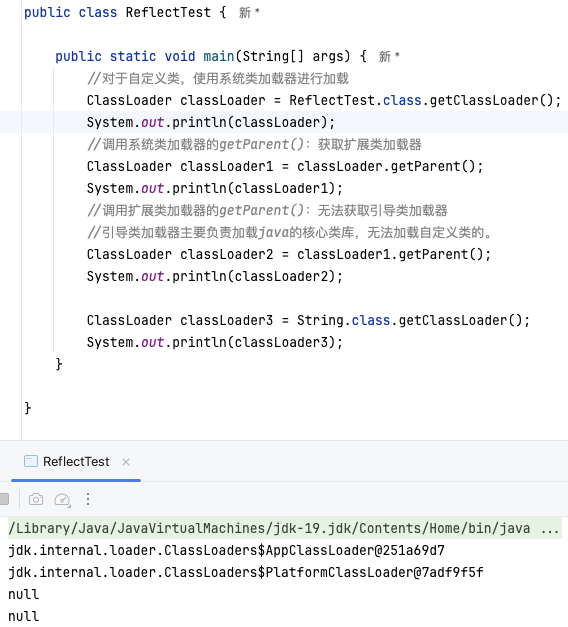

## 反射

#### 获取类的Class实例对象的三种方式

```java
public class ReflectionTest {


    //反射之前，对于Person的操作
    @Test
    public void test1() {

        //1.创建Person类的对象
        Person p1 = new Person("Tom", 12);

        //2.通过对象，调用其内部的属性、方法
        p1.age = 10;
        System.out.println(p1.toString());

        p1.show();

        //在Person类外部，不可以通过Person类的对象调用其内部私有结构。
        //比如：name、showNation()以及私有的构造器
    }

    //反射之后，对于Person的操作
    @Test
    public void test2() throws Exception {
        Class clazz = Person.class;
        //1.通过反射，创建Person类的对象
        Constructor cons = clazz.getConstructor(String.class, int.class);
        Object obj = cons.newInstance("Tom", 12);
        Person p = (Person) obj;
        System.out.println(p.toString());
        //2.通过反射，调用对象指定的属性、方法
        //调用属性
        Field age = clazz.getDeclaredField("age");
        age.set(p, 10);
        System.out.println(p.toString());

        //调用方法
        Method show = clazz.getDeclaredMethod("show");
        show.invoke(p);

        System.out.println("*******************************");

        //通过反射，可以调用Person类的私有结构的。比如：私有的构造器、方法、属性
        //调用私有的构造器
        Constructor cons1 = clazz.getDeclaredConstructor(String.class);
        cons1.setAccessible(true);
        Person p1 = (Person) cons1.newInstance("Jerry");
        System.out.println(p1);

        //调用私有的属性
        Field name = clazz.getDeclaredField("name");
        name.setAccessible(true);
        name.set(p1, "HanMeimei");
        System.out.println(p1);

        //调用私有的方法
        Method showNation = clazz.getDeclaredMethod("showNation", String.class);
        showNation.setAccessible(true);
        String nation = (String) showNation.invoke(p1, "中国");//相当于String nation = p1.showNation("中国")
        System.out.println(nation);


    }
    //疑问1：通过直接new的方式或反射的方式都可以调用公共的结构，开发中到底用那个？
    //建议：直接new的方式。
    //什么时候会使用：反射的方式。 反射的特征：动态性
    //疑问2：反射机制与面向对象中的封装性是不是矛盾的？如何看待两个技术？
    //不矛盾。

    /*
    关于java.lang.Class类的理解
    1.类的加载过程：
    程序经过javac.exe命令以后，会生成一个或多个字节码文件(.class结尾)。
    接着我们使用java.exe命令对某个字节码文件进行解释运行。相当于将某个字节码文件
    加载到内存中。此过程就称为类的加载。加载到内存中的类，我们就称为运行时类，此
    运行时类，就作为Class的一个实例。

    2.换句话说，Class的实例就对应着一个运行时类。
    3.加载到内存中的运行时类，会缓存一定的时间。在此时间之内，我们可以通过不同的方式
    来获取此运行时类。
     */
    //获取Class的实例的方式（前三种方式需要掌握）
    @Test
    public void test3() throws ClassNotFoundException {
        //方式一：调用运行时类的属性：.class
        Class clazz1 = Person.class;
        System.out.println(clazz1);
        //方式二：通过运行时类的对象,调用getClass()
        Person p1 = new Person();
        Class clazz2 = p1.getClass();
        System.out.println(clazz2);

        //方式三：调用Class的静态方法：forName(String classPath)
        Class clazz3 = Class.forName("com.atguigu.java.Person");
//        clazz3 = Class.forName("java.lang.String");
        System.out.println(clazz3);

        System.out.println(clazz1 == clazz2);
        System.out.println(clazz1 == clazz3);

        //方式四：使用类的加载器：ClassLoader  (了解)
        ClassLoader classLoader = ReflectionTest.class.getClassLoader();
        Class clazz4 = classLoader.loadClass("com.atguigu.java.Person");
        System.out.println(clazz4);

        System.out.println(clazz1 == clazz4);

    }


    //万事万物皆对象？对象.xxx,File,URL,反射,前端、数据库操作


    //Class实例可以是哪些结构的说明：
    @Test
    public void test4() {
        Class c1 = Object.class;
        Class c2 = Comparable.class;
        Class c3 = String[].class;
        Class c4 = int[][].class;
        Class c5 = ElementType.class;
        Class c6 = Override.class;
        Class c7 = int.class;
        Class c8 = void.class;
        Class c9 = Class.class;

        int[] a = new int[10];
        int[] b = new int[100];
        Class c10 = a.getClass();
        Class c11 = b.getClass();
        // 只要数组的元素类型与维度一样，就是同一个Class
        System.out.println(c10 == c11);

    }
}
```

#### 类加载器(java code Example)


```java
@Test
public void test1(){
    //对于自定义类，使用系统类加载器进行加载
    ClassLoader classLoader = ClassLoaderTest.class.getClassLoader();
    System.out.println(classLoader);
    //调用系统类加载器的getParent()：获取扩展类加载器
    ClassLoader classLoader1 = classLoader.getParent();
    System.out.println(classLoader1);
    //调用扩展类加载器的getParent()：无法获取引导类加载器
    //引导类加载器主要负责加载java的核心类库，无法加载自定义类的。
    ClassLoader classLoader2 = classLoader1.getParent();
    System.out.println(classLoader2);

    ClassLoader classLoader3 = String.class.getClassLoader();
    System.out.println(classLoader3);

}
```



AppClassLoader表示系统类加载器 继承于扩展类加载器

引导类加载器负责加载Java核心类库,该类在Java运行时环境中为null是因为它存在部分C语言开发的内容因此无法在虚拟机中被识别为Java对象

JVM运行时先由引导类加载器加载核心类库，包括扩展加载类，是的该加载器也是Java语言中的一个核心功能类

再由该类加载出赋贼开发人员自己开发的其他类加载的系统类加载器

#### 类加载的字节流创建功能

系统类加载器核心功能是将编译后的class文件使用字节输入流导入到JVM内存中的方法区,并在这里加载这个类的Class实例对象

因此系统类加载器还提供了一个根据目录获取输入流的方法

###### <u>*getResourceAsStream*</u>

```java
ClassLoader classLoader = ReflectTest.class.getClassLoader();
InputStream is = classLoader.getResourceAsStream("ReflectionTest//jdbc1.properties");
Properties pros = new Properties();
pros.load(is);
String user = pros.getProperty("user");
String password = pros.getProperty("password");
System.out.println("user = " + user + ",password = " + password);
```

#### 利用反射获取任意类的实例对象(要求该类必须声明了空参公有构造器)

方式1.通过类的Class对象的newInstance方法

方式2.通过类的Class对象的getConstructor(重载参数)先获取类的构造方法实例对象,再调用该实例对象的newInstance方法

#### 利用反射获取类的属性

```java
package ReflectionTest;

/**
 * @author sunchaowei
 * @create 2026/1/5-14:38
 */

import org.junit.Test;

import java.lang.reflect.Field;
import java.lang.reflect.Modifier;

public class FieldTest {

    @Test
    public void test1() {

        Class clazz = Person.class;

        //获取属性结构
        //getFields():获取当前运行时类及其父类中声明为public访问权限的属性
        Field[] fields = clazz.getFields();
        for (Field f : fields) {
            System.out.println(f);
        }
        System.out.println();

        //getDeclaredFields():获取当前运行时类中声明的所有属性。（不包含父类中声明的属性）
        Field[] declaredFields = clazz.getDeclaredFields();
        for (Field f : declaredFields) {
            System.out.println(f);
        }
    }

    //权限修饰符  数据类型 变量名
    @Test
    public void test2() {
        Class clazz = Person.class;
        Field[] declaredFields = clazz.getDeclaredFields();
        for (Field f : declaredFields) {
            //1.权限修饰符
            int modifier = f.getModifiers();
            System.out.print(Modifier.toString(modifier) + "\t");

            //2.数据类型
            Class type = f.getType();
            System.out.print(type.getName() + "\t");

            //3.变量名
            String fName = f.getName();
            System.out.print(fName);

            System.out.println();
        }

    }

}
```

#### 利用反射获取类的方法以及方法上的注解(其他位置上的注解同理)

```java
package ReflectionTest;

/**
 * @author sunchaowei
 * @create 2026/1/5-14:42
 */

import org.junit.Test;

import java.lang.annotation.Annotation;
import java.lang.reflect.Method;
import java.lang.reflect.Modifier;

/**
 * 获取运行时类的方法结构
 *
 * @author shkstart
 * @create 2019 下午 3:37
 */
public class MethodTest {

    @Test
    public void test1() {

        Class clazz = Person.class;

        //getMethods():获取当前运行时类及其所有父类中声明为public权限的方法
        Method[] methods = clazz.getMethods();
        for (Method m : methods) {
            System.out.println(m);
        }
        System.out.println();
        //getDeclaredMethods():获取当前运行时类中声明的所有方法。（不包含父类中声明的方法）
        Method[] declaredMethods = clazz.getDeclaredMethods();
        for (Method m : declaredMethods) {
            System.out.println(m);
        }
    }

    /*
    @Xxxx
    权限修饰符  返回值类型  方法名(参数类型1 形参名1,...) throws XxxException{}
     */
    @Test
    public void test2() {
        Class clazz = Person.class;
        Method[] declaredMethods = clazz.getDeclaredMethods();
        for (Method m : declaredMethods) {
            //1.获取方法声明的注解
            Annotation[] annos = m.getAnnotations();
            for (Annotation a : annos) {
                System.out.println(a);
            }

            //2.权限修饰符
            System.out.print(Modifier.toString(m.getModifiers()) + "\t");

            //3.返回值类型
            System.out.print(m.getReturnType().getName() + "\t");

            //4.方法名
            System.out.print(m.getName());
            System.out.print("(");
            //5.形参列表
            Class[] parameterTypes = m.getParameterTypes();
            if (!(parameterTypes == null && parameterTypes.length == 0)) {
                for (int i = 0; i < parameterTypes.length; i++) {

                    if (i == parameterTypes.length - 1) {
                        System.out.print(parameterTypes[i].getName() + " args_" + i);
                        break;
                    }

                    System.out.print(parameterTypes[i].getName() + " args_" + i + ",");
                }
            }

            System.out.print(")");

            //6.抛出的异常
            Class[] exceptionTypes = m.getExceptionTypes();
            if (exceptionTypes.length > 0) {
                System.out.print("throws ");
                for (int i = 0; i < exceptionTypes.length; i++) {
                    if (i == exceptionTypes.length - 1) {
                        System.out.print(exceptionTypes[i].getName());
                        break;
                    }

                    System.out.print(exceptionTypes[i].getName() + ",");
                }
            }


            System.out.println();
        }


    }
}
```

#### 利用反射执行其他操作

```java
package ReflectionTest;

/**
 * @author sunchaowei
 * @create 2026/1/5-14:43
 */

import org.junit.Test;

import java.lang.reflect.Constructor;
import java.lang.reflect.Field;
import java.lang.reflect.Method;

/**
 * 调用运行时类中指定的结构：属性、方法、构造器
 *
 * @author shkstart
 * @create 2019 下午 4:46
 */
public class ReflectionTest02 {

    /*

        不需要掌握
     */
    @Test
    public void testField() throws Exception {
        Class clazz = Person.class;

        //创建运行时类的对象
        Person p = (Person) clazz.newInstance();


        //获取指定的属性：要求运行时类中属性声明为public
        //通常不采用此方法
        Field id = clazz.getField("id");

        /*
        设置当前属性的值

        set():参数1：指明设置哪个对象的属性   参数2：将此属性值设置为多少
         */

        id.set(p, 1001);

        /*
        获取当前属性的值
        get():参数1：获取哪个对象的当前属性值
         */
        int pId = (int) id.get(p);
        System.out.println(pId);


    }

    /*
    如何操作运行时类中的指定的属性 -- 需要掌握
     */
    @Test
    public void testField1() throws Exception {
        Class clazz = Person.class;

        //创建运行时类的对象
        Person p = (Person) clazz.newInstance();

        //1. getDeclaredField(String fieldName):获取运行时类中指定变量名的属性
        Field name = clazz.getDeclaredField("name");

        //2.保证当前属性是可访问的
        name.setAccessible(true);
        //3.获取、设置指定对象的此属性值
        name.set(p, "Tom");

        System.out.println(name.get(p));
    }

    /*
    如何操作运行时类中的指定的方法 -- 需要掌握
     */
    @Test
    public void testMethod() throws Exception {

        Class clazz = Person.class;

        //创建运行时类的对象
        Person p = (Person) clazz.newInstance();

        /*
        1.获取指定的某个方法
        getDeclaredMethod():参数1 ：指明获取的方法的名称  参数2：指明获取的方法的形参列表
         */
        Method show = clazz.getDeclaredMethod("show", String.class);
        //2.保证当前方法是可访问的
        show.setAccessible(true);

        /*
        3. 调用方法的invoke():参数1：方法的调用者  参数2：给方法形参赋值的实参
        invoke()的返回值即为对应类中调用的方法的返回值。
         */
        Object returnValue = show.invoke(p, "CHN"); //String nation = p.show("CHN");
        System.out.println(returnValue);

        System.out.println("*************如何调用静态方法*****************");

        // private static void showDesc()

        Method showDesc = clazz.getDeclaredMethod("showDesc");
        showDesc.setAccessible(true);
        //如果调用的运行时类中的方法没有返回值，则此invoke()返回null
//        Object returnVal = showDesc.invoke(null);
        Object returnVal = showDesc.invoke(Person.class);
        System.out.println(returnVal);//null

    }

    /*
    如何调用运行时类中的指定的构造器
     */
    @Test
    public void testConstructor() throws Exception {
        Class clazz = Person.class;

        //private Person(String name)
        /*
        1.获取指定的构造器
        getDeclaredConstructor():参数：指明构造器的参数列表
         */

        Constructor constructor = clazz.getDeclaredConstructor(String.class);

        //2.保证此构造器是可访问的
        constructor.setAccessible(true);

        //3.调用此构造器创建运行时类的对象
        Person per = (Person) constructor.newInstance("Tom");
        System.out.println(per);

    }

}
```
